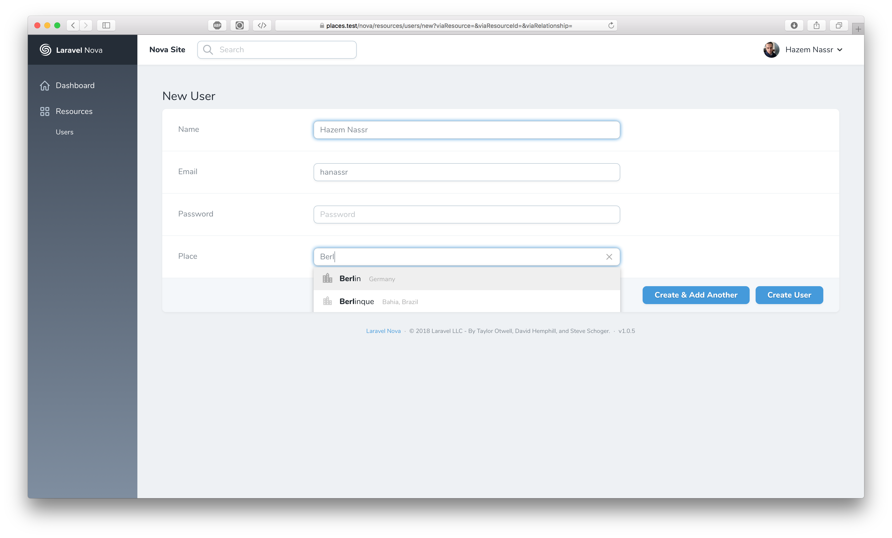

# Nova Places

[](https://packagist.org/packages/hnassr/nova-places)

[](https://travis-ci.org/hnassr/nova-places)
[](https://scrutinizer-ci.com/g/hnassr/nova-places)
[](https://packagist.org/packages/hnassr/nova-places)


This package add to laravel nova [algolia places](https://github.com/algolia/places) field

## Screenshots


## Installation

You can install the package in to a Laravel app that uses [Nova](https://nova.laravel.com) via composer:

```bash
composer require hnassr/nova-places
```

```php
['country', 'county', 'administrative', 'city', 'full', 'countryCode', 'latlng', 'postcode'] // Available Fileds
```

```php
Places::make('Place', 'place')
    ->locale('de') // default locale is en
    ->countries(['us', 'uk']) // Search in specific countries
    ->indexField('city') // what to show in resource index page
    ->showFields(['country', 'county', 'administrative', 'city', 'full']), // what to show in resource preview page
```

## Contributing

Please see [CONTRIBUTING](CONTRIBUTING.md) for details.

### Security

If you discover any security related issues, please email hanassr@gmail.com instead of using the issue tracker.

## Credits

- [Hazem Nassr](https://github.com/:hnassr)

## License

The MIT License (MIT). Please see [License File](LICENSE.md) for more information.
